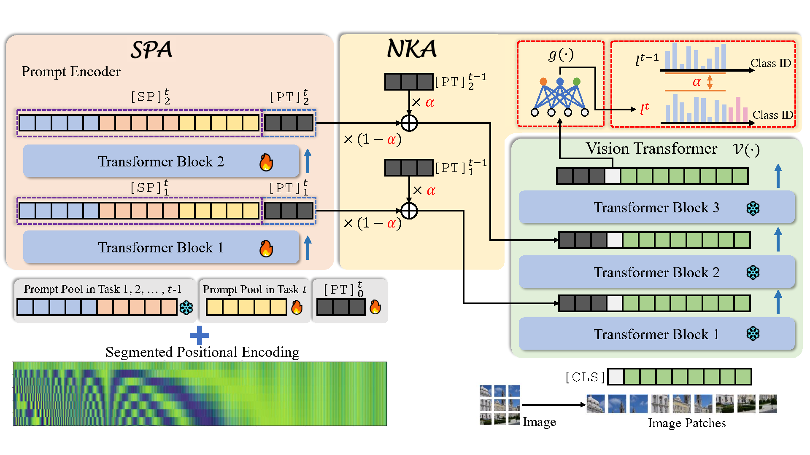

## PEARL: Input-Agnostic Prompt Enhancement with Negative Feedback Regulation for Class-Incremental Learning (Accepted by AAAI-25)

*Yongchun Qin, [Pengfei Fang](https://fpfcjdsg.github.io/), [Hui Xue](http://palm.seu.edu.cn/hxue/)*

Detailed supplementary materials are available in [arxiv](https://arxiv.org/abs/2412.10900).

If you have any questions, feel free to contact Yongchun Qin (ycqin@seu.edu.cn).

Our contributions:
- We propose a novel CIL framework called **PEARL**, where a prompt encoder generates uniform prompts infused with global knowledge and accumulates knowledge through a momentum-based update strategy driven by negative feedback regulation. 
- We introduce the **SPA** module, which enables a global prompt to simultaneously encapsulate knowledge from different tasks, overcoming the shortcomings of current ``query-select'' mechanism.    
- The proposed **NKA** mechanism effectively implements an adaptive momentum update, achieving efficient knowledge accumulation by leveraging inherent data correlations.
- Through extensive experiments, we demonstrate that our method achieves state-of-the-art performance, surpassing the second-best results by an average of 2.23\% in accuracy across six benchmarks.




Thanks to LAMDA-PILOT (https://github.com/LAMDA-CL/LAMDA-PILOT)


## Citations
If you use any content of this repo for your work, please cite the following bib entries:
  ```
@inproceedings{qin2025pearl,
  title={PEARL: Input-Agnostic Prompt Enhancement with Negative Feedback Regulation for Class-Incremental Learning},
  author={Qin, Yongchun and Fang, Pengfei and Xue, Hui},
  booktitle={Proceedings of the AAAI Conference on Artificial Intelligence},
  volume={39},
  number={19},
  pages={20051--20059},
  year={2025}
}

@article{sun2025pilot,
    title={PILOT: A Pre-Trained Model-Based Continual Learning Toolbox},
    author={Sun, Hai-Long and Zhou, Da-Wei and Zhan, De-Chuan and Ye, Han-Jia},
    journal={SCIENCE CHINA Information Sciences},
    year={2025},
    volume = {68},
    number = {4},
    pages = {147101},
    doi = {https://doi.org/10.1007/s11432-024-4276-4}
}
  ```
